# FHE-DKSAP: Fully Homomorphic Encryption based Dual Key Stealth Address Protocol

[](https://www.rust-lang.org)
[](LICENSE)

A Rust implementation of the FHE-DKSAP (Fully Homomorphic Encryption based Dual Key Stealth Address Protocol) for enhanced privacy in blockchain transactions.

## ⚠️ Security Notice

**This implementation is for research and educational purposes only. It has not been audited and is not intended for production use. Use at your own risk.**

## Introduction

FHE-DKSAP is an advanced stealth address protocol that leverages Fully Homomorphic Encryption (FHE) to provide enhanced privacy protection for blockchain transactions. This protocol addresses the limitations of traditional Dual-Key Stealth Address Protocols (DKSAP) by:

- **Quantum Resistance**: Built on lattice-based cryptography, providing protection against quantum computing attacks
- **Enhanced Privacy**: Computations are performed over encrypted data, preventing key leakage attacks
- **Outsourced Computation**: Enables third-party verification without revealing private keys

This implementation is based on the research presented in the [Ethereum Research Forum](https://ethresear.ch/t/fhe-dksap-fully-homomorphic-encryption-based-dual-key-stealth-address-protocol/16213).

## How It Works

### Protocol Overview

FHE-DKSAP is an advanced stealth address protocol that builds upon DKSAP and BasedSAP with significant privacy and security improvements. The protocol operates through three main phases:

#### Phase 1: Bob's Setup (Receiver)

Bob creates two key pairs for enhanced privacy and security:

1. **Ethereum Wallet Key Pair** `(sk₂, PK₂)`:
   - `sk₂` is a randomly generated Ethereum wallet private key for stealth address spending
   - This key does not need to be registered on Ethereum before use and is separate from Bob's main wallet
   - `PK₂` is the corresponding public key generated using standard Ethereum address conversion

2. **FHE Key Pair** `(sk_b, PK_b)`:
   - `sk_b` is Bob's FHE private key for encryption and decryption operations
   - `PK_b` is used to encrypt `sk₂` into ciphertext `C₂`
   - Due to FHE's quantum resistance, it's safe to encrypt the private key

3. **Public Sharing**: Bob publicly shares `PK₂`, `PK_b`, and the encrypted `C₂`

#### Phase 2: Alice's Transaction (Sender)

Alice generates a unique ephemeral key pair for each stealth address transaction:

1. **Ephemeral Key Generation**: Alice creates `(sk₁, PK₁)` randomly for each transaction
   - `sk₁` is an Ethereum ephemeral private key
   - The corresponding public key/wallet address doesn't need Ethereum registration

2. **Stealth Address Creation**:
   - Alice combines her ephemeral public key `PK₁` with Bob's public key `PK₂` to obtain `PK_z`
   - The stealth address is generated from `PK_z` using standard Ethereum address conversion

3. **Encryption and Broadcasting**:
   - Alice encrypts her ephemeral private key `sk₁` using Bob's FHE public key `PK_b`, creating ciphertext `C₁`
   - Alice broadcasts `C₁` in an untrackable manner so Bob can retrieve it
   - **Important**: Alice cannot know the stealth address's private key since private keys cannot be derived from public keys

#### Phase 3: Bob's Recovery

Bob recovers the stealth address private key using FHE operations:

1. **Ciphertext Addition**: Bob receives `C₁` and adds the two ciphertexts (`C₁ + C₂`) to obtain `C`

2. **FHE Decryption**: Using the additive homomorphism property of FHE, Bob decrypts `C` with his FHE private key `sk_b`
   - The decryption result is the stealth address private key `sk_z`

3. **Stealth Address Control**: Bob can now generate the stealth address from `sk_z` and control the wallet
   - Only Bob possesses the private key `sk_z` to spend from the stealth address

### Key Improvements Over Traditional DKSAP

FHE-DKSAP provides significant enhancements compared to DKSAP and BasedSAP:

- **Enhanced Privacy**: All computations are performed over encrypted data (ciphertext), protecting sensitive information
- **Key Leakage Prevention**: Eliminates the risk of private key and personal information leakage
- **Quantum Resistance**: Built on lattice-based FHE cryptography, providing protection against quantum computing attacks
- **Outsourced Verification**: Enables third-party verification without revealing private keys
## Protocol Flow

```mermaid
sequenceDiagram
    participant Bob as Receiver (Bob)
    participant Alice as Sender (Alice)
    participant Chain as Blockchain
    participant Network as Network

    Note over Bob: Phase 1: Bob's Setup
    Bob->>Bob: Generate Ethereum wallet key pair (sk₂, PK₂)
    Bob->>Bob: Generate FHE key pair (sk_b, PK_b)
    Bob->>Bob: Encrypt sk₂ using PK_b → C₂
    Bob->>Network: Publish PK₂, PK_b, C₂ publicly

    Note over Alice: Phase 2: Alice's Transaction
    Alice->>Alice: Generate ephemeral key pair (sk₁, PK₁)
    Alice->>Alice: Combine PK₁ + PK₂ → PK_z
    Alice->>Alice: Generate stealth address from PK_z
    Alice->>Alice: Encrypt sk₁ using PK_b → C₁
    Alice->>Chain: Send transaction to stealth address
    Alice->>Network: Broadcast C₁ (untrackable)

    Note over Bob: Phase 3: Bob's Recovery
    Bob->>Network: Receive C₁
    Bob->>Bob: Add ciphertexts: C₁ + C₂ → C
    Bob->>Bob: Decrypt C using sk_b → sk_z
    Bob->>Bob: Generate stealth address from sk_z
    Bob->>Chain: Spend from stealth address using sk_z
```



## Installation

### Prerequisites

- Rust 1.81 or later
- Cargo package manager

### Installation Options


#### Option 1: From Crates.io

Add the following to your `Cargo.toml`:

```toml
[dependencies]
fhe-dksap = "0.1.0"
```

#### Option 2: From Git Repository (Latest Development)

```bash
# Clone the repository
git clone https://github.com/Envoy-VC/fhe-dksap
cd fhe-dksap

# Build the project
cargo build --release

# Run the example
cargo run --example user_flow
```

## Usage

### Basic Example

The main example demonstrates the complete FHE-DKSAP protocol:

```rust
use secp256k1::Secp256k1;
use tfhe::ConfigBuilder;
use fhe_dksap::{
    generate_ethereum_key_pair, generate_fhe_key_pair, generate_stealth_address,
    recover_secret_key, encrypt_secret_key
};

fn main() -> Result<(), Box<dyn std::error::Error>> {
    println!("🚀 Starting FHE-DKSAP Protocol Demonstration");
    
    // Initialize cryptographic contexts
    let secp = Secp256k1::new();
    let config = ConfigBuilder::default().build();
    
    // Phase 1: Bob (Receiver) Setup
    println!("\n📋 Phase 1: Bob (Receiver) Setup");
    
    // Generate Ethereum wallet key pair for stealth address spending
    let receiver_eth_keypair = generate_ethereum_key_pair(&secp)?;
    
    // Generate FHE key pair for encryption/decryption
    let receiver_fhe_keypair = generate_fhe_key_pair(config)?;
    
    // Encrypt the receiver's secret key
    let receiver_enc_secret_key = encrypt_secret_key(
        receiver_eth_keypair.secret_key,
        &receiver_fhe_keypair.public_key,
    );
    
    println!("✅ Receiver setup completed");
    
    // Phase 2: Alice (Sender) Creates Stealth Address
    println!("\n📋 Phase 2: Alice (Sender) Creates New Stealth Address");
    
    let stealth_address = generate_stealth_address(
        &secp,
        &receiver_eth_keypair.public_key,
        &receiver_fhe_keypair.public_key,
    )?;
    
    println!("✅ Stealth address generated");
    println!("Stealth Address: {}", stealth_address.stealth_address);
    
    // Phase 3: Bob (Receiver) Recovers Stealth Address
    println!("\n📋 Phase 3: Bob (Receiver) Recovers Stealth Address Secret Key");
    
    let recovered_keypair = recover_secret_key(
        &secp,
        &receiver_fhe_keypair,
        &receiver_enc_secret_key,
        &stealth_address.encrypted_secret_key,
    )?;
    
    let phase3_end = phase3_start.elapsed();
    println!("✅ Stealth address private key recovered");
    
    // Verification
    println!("\n🔍 Verification");
    let recovered_address = fhe_dksap::utils::pk_to_eth_address(&recovered_keypair.public_key);
    let is_valid = stealth_address.stealth_address == recovered_address;
    
    if is_valid {
        println!("✅ SUCCESS: Recovered stealth address matches generated address!");
    } else {
        println!("❌ ERROR: Address verification failed!");
    }
    
    Ok(())
}
```

### Running Examples

To run the examples:

```bash
# Run the main example
cargo run --example user_flow

# Run with release optimizations (recommended for performance)
cargo run --release --example user_flow
```

## Contributing

We welcome contributions to improve the FHE-DKSAP implementation!

## Acknowledgements

### Research Foundation

This implementation is based on the groundbreaking research presented in:
- **[FHE-DKSAP Research Paper](https://ethresear.ch/t/fhe-dksap-fully-homomorphic-encryption-based-dual-key-stealth-address-protocol/16213)** - The original research by Ethereum Fellows
- **EIP-5564** - Stealth Addresses for Ethereum
- **BasedSAP** - The foundational stealth address protocol

### Cryptographic Libraries

- **[TFHE-rs](https://github.com/zama-ai/tfhe-rs)** - Fully Homomorphic Encryption library by Zama AI
- **[secp256k1](https://github.com/bitcoin-core/secp256k1)** - Bitcoin/Ethereum elliptic curve implementation
- **[sha3](https://github.com/RustCrypto/hashes)** - Keccak-256 hashing implementation

## License

This project is licensed under the MIT License - see the [LICENSE](LICENSE) file for details.

**Disclaimer**: This software is provided "as is" without warranty of any kind. Use at your own risk and only for research purposes.
